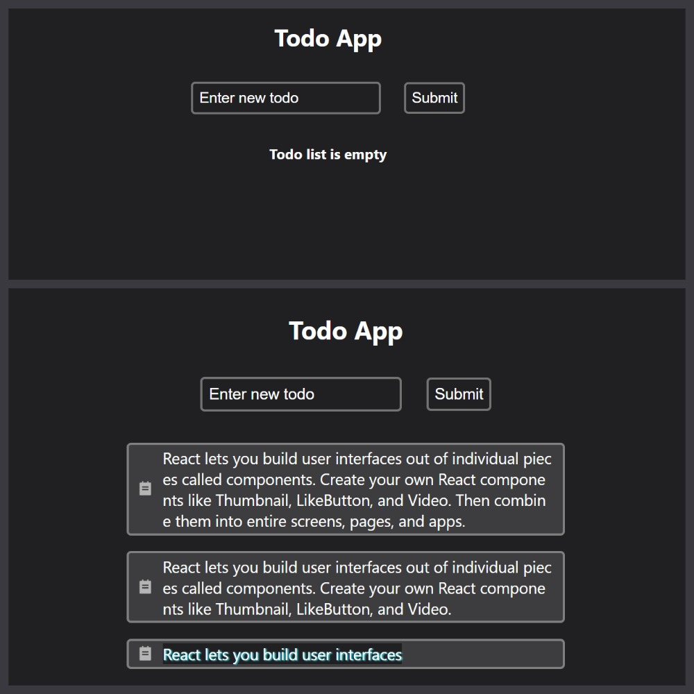

# EasyTodo

Данный проект был создан для закрепления знаний по курсу Udemy "Полный курс по React"

Задачи по проекту:

- Создание всех компонентов.
- Добавление задач в список при нажатии кнопки Submit.
- При отсутствии задач выводить отдельный компонент сообщающий об этом.
- При двойном клике на задачу, удалять ее Позже сделать для этого отдельную кнопку.

Архитектура сделана приблизительно по проекту из курса. Стили сделал сам, полностью отличающиеся от проекта по курсу.

Данный проект можно посмотреть по ссылке
:point_right: [EasyTodo](https://eloquent-yeot-84b1f8.netlify.app).

---

# 1.0 Стартовая версия проекта

- Созданы компоненты.
- Добавлены и настроены первоначальные стили.

---

# 1.1 EasyTodo

- Добавлено сообщение при отсутствии Todo.
- Настроены стили увеличивающие Todo при необходимости.
- Настроены стили при выделении текста.
- При двойном клике на Todo - удаляется.
- Изменена структура на более правильную.
- Проект залит на Netlify, добавлена ссылка в описание.

---
