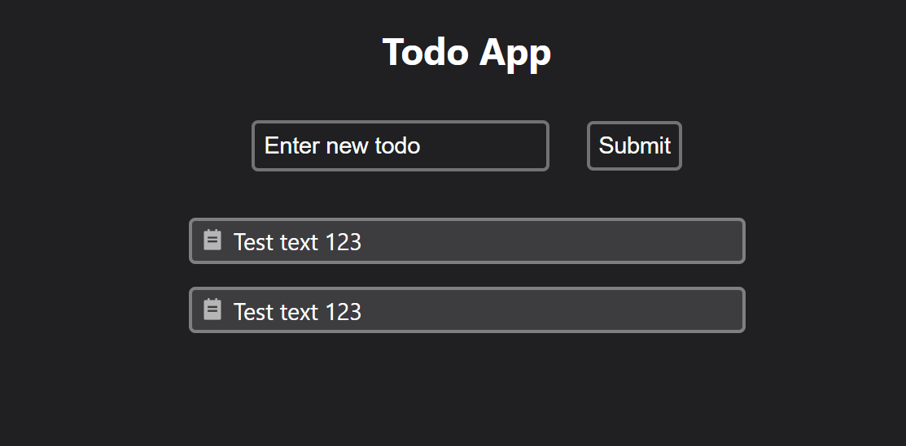

# EasyTodo

Данный проект был создан для закрепления знаний по курсу Udemy "Полный курс по React"

Задачи по проекту:

- Создание всех компонентов.
- Добавление задач в список при нажатии кнопки Submit
- При отсутствии задач выводить отдельный компонент сообщающий об этом.
- При двойном клике на задачу, удалять ее. Позже сделать для этого отдельную кнопку.

Архитектура сделана приблизительно по проекту из курса. Стили сделал сам, полностью отличающиеся от проекта по курсу.

---

Версии проекта:

# 1.0 Стартовая версия проекта

